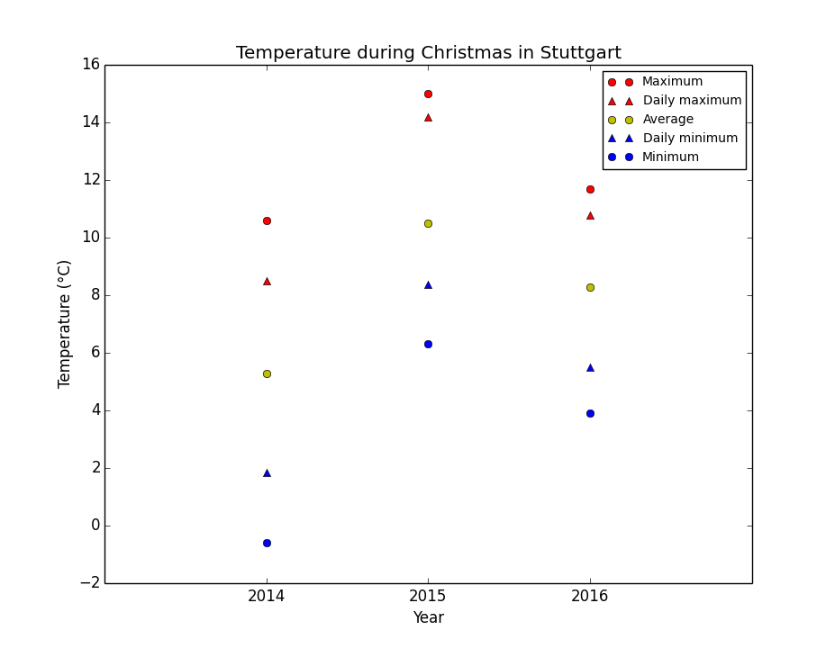
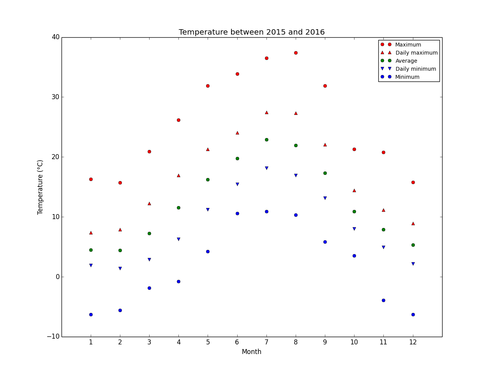

# WeatherStats

WeatherStats is a collection of (cross-platform) Python scripts for general sensor data management and analysis with a local SQLite database as backbone. The design of the software is quite general but the main application is weather data like temperature, precipitation, etc. A central feature is a user-friendly interface to [Netatmo](https://www.netatmo.com/) servers: remote data of Netatmo sensors can be automatically downloaded and added to the local database for analysis. Interfaces for other data devices may be added in the future. 

I've written this software just for myself, it's open source and free (GPL). If it's also useful for you, I'd be happy about a donation. [](https://www.paypal.com/cgi-bin/webscr?cmd=_s-xclick&hosted_button_id=VL83YL3RYH66N)
   
By Ulrich Thiel, thiel@mathematik.uni-stuttgart.de

* * *


## Downloads
For Windows and MacOS it's easiest to download the stand-alone [binaries](https://github.com/thielul/WeatherStats/releases/latest). Note that these programs are executed in a terminal<sup><a href="#terminal">1</a></sup> with specific options as discussed below. You can of course also download the latest [source code](https://github.com/thielul/WeatherStats/archive/master.zip) and execute the Python scripts directly. To this end, you'll need [Python 2](https://www.python.org/downloads/) (version 2, not version 3; both versions may co-exist on your system though) and [Scipy](https://www.scipy.org/install.html) (I recommend installing a pre-compiled bundle like [Anaconda](https://www.continuum.io/downloads)). 


## Quick start
The following is a short guide for using WeatherStats to manage and analyze Netatmo data. You can find more detailed information below. 
 
First, create an empty database with the program ```CreateEmptyDB```. Add your Netatmo account using ```AddNetatmo``` and follow the on-screen instructions for obtaining a client secret. You can add as many accounts as you like. Now, run ```UpdateNetatmo```. This automatically adds all available sensors and modules to the database and also downloads all available data which is then inserted into the SQLite database ```Weather.db```. The initial download may take a while (roughly 30 minutes for 2 years of data). If you run this program again later, only new data will be added and this is much quicker of course. In this way you can always keep an up-to-date database. If you get an HTTP error while updating, you either misspelled your account credentials or it's a timeout by the Netatmo servers—just try again at a later time. You can now compute statistics using the program ```Stats```. Running ```Stats --help``` lists the available options. The main feature is that you can define certain filters to analyze only specific time windows. Here are four examples which should make clear how it works:

#### Example 1
```
./Stats.py --sensors==6
Sensor: 		6
  Module: 		2
  Measurand:	Temperature (°C)
  Calibration: 	0
  Resolution: 	12 pph

  Overall statistics:
    Selection: 	813 days/19512 hours between 2014-10-14 and 2017-01-03
    Quality:  	97% (19104/19512, 227745/234144)
    Maximum: 	37.4 (2015-08-07 17h)
    Minimum: 	-8.5 (2014-12-29 01h)
    Average:	12.033 (sigma=7.781)
    Daily max:	16.172 (sigma=8.143)
    Daily min:	8.24 (sigma=6.599)
```
As described below in more detail, every sensor gets a unique fixed id. You can list the sensors with the ```ListSensors``` program. In my case, sensor 6 is the outdoor temperature sensor. Calling ```Stats``` with the option ```--sensors=6``` and no further option computes overall statistics for this sensor taking all available data into account. Again, this may take a while. In my case, 227,745 data points over more than two years were taken into account.

#### Example 2

```./Stats.py --sensors=6 --years=2014-2016 --months=12 --days=24-26 --yearly --plot```

With this selection we can get an overview of the temperatures during Christmas over the years 2014 to 2016. The additional ```plot``` option also creates a plot of the results. 



#### Example 3

```./Stats.py --sensors=6 --years=2015-2016  --monthly --plot```

Again we consider the outdoor temperature but this time we compute statistics for each month between 2015 and 2016, thus obtaining an actual climate diagram. In my case, 204,679 data points were taken into account with a total data quality of 97% (see below for a discussion of data quality), so the average over these two years is quite accurate.

 

#### Example 4

```./Stats.py --sensors=6 --start=2016-05-11 --end=2016-06-17 --hours=7-8```

This computes statistics for the outdoor temperature between 7 and 8 o'clock between May 11, 2016 and June 17, 2016.


## Detailed functionality

In this section, the functionality of WeatherStats is discussed in more detail. 

### The database
The backbone of WeatherStats is the local SQLite database ```Weather.db``` in the directory of WeatherStats. If you just downloaded WeatherStats, you need to create an empty database with the program ```CreateEmptyDB```. I suggest taking a look at this database with an SQLite browser like [DB Browser for SQLite](http://sqlitebrowser.org). With such a browser you can also edit the tables and do some fine-tuning. The basic idea behind the structure of the database is as follows. 

#### Sensors
We will manage data of arbitrary and arbitrarily many sensors, so there is a table called Sensors listing these with additional information. Each sensor has a unique id given by the **Id** column. This is also the id you can pass to the ```Stats.py``` program. The meaning of the **Measurand**, **Unit**, and **Description** columns should be clear. In the **Calibration** column you can define a fixed calibration for each sensor meaning that this value will be added to each recorded value to get the actual value. For example, I know that the humidity of my outdoor humidity sensor is always 6% too low, so I set calibration to 6. The column **pph** gives the temporal resolution of the sensor in *points per hour* (pph). For example, Netatmo devices record one value every 5 minutes, so this is 12 pph. This information is used for the quality analysis of the data. Finally, there is the column **Module**: for us, a module is a collection of sensors and in this column the id of the corresponding module is specified. So, all sensors with the same module id belong to the same module. We will discuss this point of view in more detail below. 

#### Adding a sensor
You can manually add a sensor with the program ```AddSensor```.

#### Data
Each sensor gets an own table for its data and this will be called **DataN**, where N is the sensor id. This splitting into distinct tables makes computations a bit quicker if you have a lot of records. The structure of the data tables is simple: at a given UNIX timestamp given by **Timestamp** the sensor value at this time is listed in the **Values** column. Giving the time as a UNIX timestamp is probably most convenient since it is timezone and daylight saving independent. Netatmo stores the data on their servers also using UNIX timestamps. Of course, for the analysis we would rather like to use local time instead of timestamps. This local time is given by the columns **Year**, **Month**, **Day**, **Hour**, **Minute**, **Second**. But the question is: what is local? To convert the timestamp to local time we need to know in which timezone the sensor was located at each timestamp (we may have moved the sensor in the past). This is taken care of by the ModuleLocations table. Let us first discuss the Modules table.  

#### Modules
As described above, a module is a collection of sensors and with this table we manage the modules. The column **Id** is again the unique id of each module as referred to by the Sensors table. The **Description** column is again obvious. The reason why we package sensors into modules is that in this way we can easily set the geographic locations of sensors.

#### ModuleLocations
Here, we manage the geographic locations of modules (and thus, of sensors). For each module given by **ModuleId** we set for a given defined by **BeginTimestamp** and **EndTimestamp** in UNIX timestamps a geographic location id given by **LocationId**. So, ModuleId was between BeginTimestamp and EndtimeStamp located at LocationId. The idea here is that we may at some point move our module to another location (perhaps because we moved to another house) and we want to keep track of this since if we actually moved to another timezone we have to get the correct local time of the timestamps of the data records. If you never moved your module you may simply set **BeginTimestamp** to 0 and **EndTimestamp** to 2<sup>63</sup>-1 = 9223372036854775807.

#### Locations
Here, we manage the locations as referred to by the LocationId column in the ModuleLocations table. The column **Id** is this LocationId and the meaning of the remaining columns **PositionNorth**, **PositionEast**, **Elevation**, **Description**, and **Timezone** is obvious. 

#### DataFull
The table DataFullN, where N is the sensor id, is a view joining several tables to match a timestamp with the timezone of the corresponding module. Using this view one can easily convert the timestamps in the data table to local times. This is done automatically by the program ```SetDatesInDB```. If you remember that some module was in the past for a certain time located at another timezone, you can add this information to the ModuleLocations table and run ```SetDatesInDB --all``` to recompute all local times.

### Netatmo
If you want to manage and analyze data of [Netatmo](https://www.netatmo.com/) devices, most of what was discussed above is handled automatically by the ```AddNetatmo``` and ```UpdateNetatmo``` programs. Sensors, modules, locations (timezones), etc. are all obtained from the servers. In most cases you don't have to look at the database at all, you can directly start computing statistics using the ```Stats``` program. The only thing you might want to do is to define a non-zero calibration for a sensor and to set location windows for modules as described above (the data on the Netatmo servers won't take timezone changes into account; we do). You can do all this fine-tuning easily with an SQLite browser like [DB Browser for SQLite](http://sqlitebrowser.org).

### Stats

The program ```Stats``` computes statistics from the database for one or more sensors given by the ```sensors``` option. 


#### Filters
One important aspect is the possibility to compute statistics only for certain time windows or even more general time patterns. There are several options, which you can view using ```Stats --help```, to define such **filters** for the statistics. You can check the examples at the beginning to see how it works.

#### Data quality
One important aspect is data quality. Imagine you want to compute statistics for a whole month, say May, but for some reason your sensor stopped working at May 7. Then you need to be informed that a lot of data is missing and that your statistics are corrupt. This is taken care of by the ```Stats``` program with the quality information. This is a percentage computed as follows. For each hour lying in the selection defined by the filters we check if we indeed have as many data points as described by the **pph** column of the sensor. If this is not the case, we count this particular hour as a *bad hour*. The data quality is now the quotient of the number of bad hours by the number of all hours in the selection. With the option ```missing``` you can output all the *bad hours* to see where your data is corrupt. The quality output furthermore shows how many data points have been considered and how many would have been considered with the pph resolution.

<!---
##Detailed installation instructions
To execute the python scripts, you'll need [Python 2](https://www.python.org/downloads/) (version 2, not version 3; both versions may co-exist on your system though). There are distributions for essentially any operating system. You'll also need to install [Scipy](https://www.scipy.org/install.html) and Matplotlib (and Colorama for Windows). It recommend to install a pre-compiled bundle like [Anaconda](https://www.continuum.io/downloads).


###Windows

To run python from the terminal you first have to add the python installation directory to the PATH variable as described [here](https://docs.python.org/2.7/using/windows.html#excursus-setting-environment-variables). Next, open a terminal with administrator access by clicking on Start, entering "cmd", right clicking on "cmd" above, and then left clicking on "Open as administrator". Make sure that entering the command ```python``` works (it should if you have set the PATH variable correctly). Now, download ```get-pip.py``` from [here](https://pip.pypa.io/en/latest/installing/) and run ```python get-pip.py``` in the download directory. Download the NumPy+MKL, Scipy, Matplotlib, and Colorama package from [this site](http://www.lfd.uci.edu/~gohlke/pythonlibs/) and install them using 

```
python -m pip install numpy‑1.11.3+mkl‑cp27‑cp27m‑win32.whl
python -m pip install scipy‑0.18.1‑cp27‑cp27m‑win32.whl
python -m pip install matplotlib‑1.5.3‑cp27‑cp27m‑win32.whl
python -m pip install colorama‑0.3.7‑py2.py3‑none‑any.whl
```

(you might have newer version numbers in the file names of course). Now, you're ready to run WeatherStats.


###Unix/MacOS
Install pip by downloading ```get-pip.py``` from [here](https://pip.pypa.io/en/latest/installing/) and running ```python get-pip.py``` in the download directory. You can now install the dependencies using ```pip install -r```. 
-->

***

<sub><a name="terminal">1:</a> Under Windows you can open a terminal by clicking on Start, entering "cmd", and hitting enter. See [here](http://www.computerhope.com/issues/chusedos.htm) for a basic tutorial. Under MacOS you can open a terminal by hitting Command+Space, entering "terminal", and hitting enter. See [here](http://blog.teamtreehouse.com/introduction-to-the-mac-os-x-command-line) for a basic tutorial. Under Linux you probably know how it works.</sub>